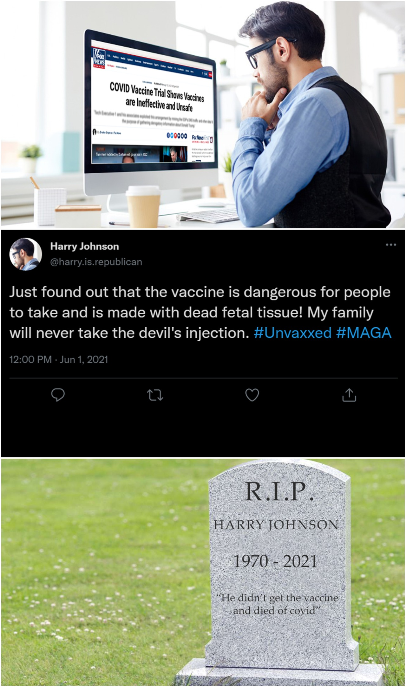

# The saga of Anne Johnson

This website is a testament to what happens when you do not fact-check your news, and believe misinformation. It is told in the form of several pieces of media depicting various aspects of the Johnson family's life. The primary character is Anne Johnson, who witnesses the effects of misinformation firsthand as they affect her husband.

## The Glossary

In order to understand the gravity of this concept, several words must be defined. This glossary gives definitions and information about several related topics.

[Click here to view the glossary](../glossary/glossary.pdf)

## The Dialogue

Anne and Harry Johnson have dinner with Harry's sister and her family (the Peters family). In this scene, we get insight into the Johnson family's views on vaccines, as opposed to the Peters family's more liberal views.

[Click here to view the dialogue](../dialogue/dialogue.pdf)

## The Diary

This is a diary kept by Anne Johnson. It depicts her more moderate views on the vaccine towards the beginning of the pandemic, her increasingly radical views toward the middle, and her regretful views after the passing of her husband.

[Click here to view the diary](../diary/diary.pdf)

## The Memo

The 2 attached business memos depict Harry's workplace (BigMoney inc.) and the attitude toward vaccine misinformation, and the response to the death of Harry and another coworker, respectively.

[Click here to view the memo](../memo/memo.pdf)

## The Comic

This comic sums up Harry's fatal mistake in 3 panels. It can be used as a standalone deterrent from vaccine misinformation, but carries more weight when you take all the other forms of media into account.

